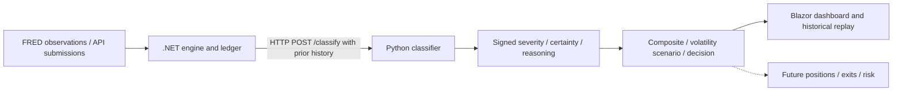

# PrimeScore Markets

[](https://github.com/raadupop/primescore-ai/actions/workflows/checks.yml)

PrimeScore AI is developing event-driven volatility intelligence for options research. This repository contains the .NET Markets engine, Python classifier, local replay demo and agent harness (instructions, hooks and code checks).

**PrimeScore Markets** is intended for **markets.primescore.ai**. The umbrella brand site and Cloudflare workspace live in `D:\Work\primescore`, which includes this repository as the `products/markets` Git submodule. Active Markets development stays here.



The engine records simulation decisions; it places no orders. Its volatility scenario uses an uncalibrated multiplier, not an independent forecast.

## Available and planned

| Available in this repository | Planned or incomplete |
| --- | --- |
| Market-data and macroeconomic classification behind an OpenAPI contract | Cross-asset and geopolitical classification; model/RAG integration |
| Daily FRED ingestion, append-only ledger, composite and simulation decisions | Independent volatility forecasting and calibrated signals |
| Blazor dashboard, historical replay, configuration editing and operator sign-in | Options prices, positions, exits, portfolio risk and broker execution |
| Agent hooks, bounded steering, tests and architecture contracts | Independent market-outcome validation and six-architecture benchmark results |

[Status and audit](docs/STATUS.md) · [Known limitations](apps/classification/LIMITATIONS.md) · [Requirements](doc/srs/PrimeScore-SRS.md) · [Engine API design](doc/PrimeScore-API-v1.yaml)

## Run PrimeScore Markets

[Install, set the operator password and run the engine](docs/ENGINE.md). [Engine limits](apps/engine/LIMITATIONS.md).

## Run the replay demo

Use **Python 3.12** in a virtual environment. From the repository root:

```sh
python -m venv .venv
```

Activate it with `.venv/Scripts/Activate.ps1` on PowerShell or `source .venv/bin/activate` on macOS/Linux, then:

```sh
python -m pip install -r apps/classification/requirements-dev.txt
python scripts/demo.py
```

Open **http://127.0.0.1:8080**. Choose a historical snapshot, replay it, and inspect the event, classification and volatility scenario. The replay uses bundled historical observations and requires no provider or model credentials.

The scenario applies a visible, uncalibrated multiplier to single-event conviction (`severity × certainty`). It demonstrates data flow and arithmetic; it is not an independently estimated fair value, a trading recommendation or a backtest of returns. See the [demo scope](docs/DEMO.md).

## Agent engineering

The engineering approach is **agentic AI systems operating under upfront constraints and runtime validation**. Agent context and architecture contracts set boundaries; tool hooks run deterministic code checks; a bounded steering loop reports failures and escalates stalled retries. ADRs preserve decisions and limitations identify what the checks cannot establish.

These are development-time controls around coding agents. The classification prototype does not yet run geopolitical language-model inference. [Harness inventory](apps/classification/HARNESS.md) · [Architecture decision](doc/adr/0001-agent-harness-architecture.md)

The six-architecture comparison is deferred; its design remains available for a future research task.

Run the same checks used by GitHub Actions from Git Bash or a POSIX shell, with the virtual environment active:

```sh
bash harness/check-suite.sh
```

The suite includes pytest, fitness tools, dependency boundaries and both OpenAPI specifications. Credential-dependent provider integration is separate; documented fixture gaps remain visible in the test report.

## Websites

The [Markets page](sites/markets/) uses static HTML, CSS and JavaScript. The brand page lives in `D:\Work\primescore\sites\brand`. The Python replay demo runs separately.

The [engine launcher](docs/ENGINE.md) also starts Markets at <http://127.0.0.1:8091>.
For the product website only, run `.\scripts\start-websites.ps1`. To include the
brand at <http://127.0.0.1:8090>, use the umbrella's `scripts/start-markets.ps1`
with `-MarketsRoot D:\Work\invex`. Ctrl+C stops the selected launcher's services.

## Licence

No open-source licence is currently provided. Provider datasets and archived third-party documents retain their own terms.

## Founder

**Radu Pop — Founder & Engineer.** [Contact Radu](https://github.com/raadupop)
