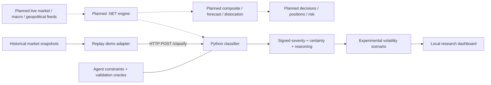

# PrimeScore AI

[](https://github.com/raadupop/primescore-ai/actions/workflows/checks.yml)

PrimeScore AI is developing event-driven volatility intelligence for options research: classify events, estimate their relevance, and investigate gaps between a volatility scenario and observed implied volatility. This repository contains the Python classification prototype, its agent harness (instructions, hooks and code checks), the engine's design contracts, and a historical replay demonstration.

The first product is **PrimeScore Markets**, intended for **markets.primescore.ai**. The umbrella brand at **primescore.ai** also has contract and credit optimisation as a future direction.



Solid arrows describe the demonstration; dotted arrows describe the planned engine. The demo's single-event scenario does not implement the engine's composite score or establish predictive accuracy.

## Available and planned

| Available in this repository | Planned or incomplete |
| --- | --- |
| Market-data and macroeconomic classification behind an OpenAPI contract | Cross-asset and geopolitical classification; model/RAG integration |
| Historical replay, signed severity, certainty dimensions and reasoning traces | Live ingestion, independent volatility forecasting and calibrated signals |
| Local three-view demo dashboard | .NET engine, persistence, portfolio risk and position management |
| Agent hooks, bounded steering, tests and architecture contracts | Independent market-outcome validation and six-architecture benchmark results |

[Status and audit](docs/STATUS.md) · [Known limitations](apps/classification/LIMITATIONS.md) · [Requirements](doc/srs/PrimeScore-SRS.md) · [Engine API design](doc/PrimeScore-API-v1.yaml)

## Run the replay demo

Use **Python 3.12** in a virtual environment. From the repository root:

```sh
python -m venv .venv
```

Activate it with `.venv/Scripts/Activate.ps1` on PowerShell or `source .venv/bin/activate` on macOS/Linux, then:

```sh
python -m pip install -r apps/classification/requirements-dev.txt
python scripts/demo.py
```

Open **http://127.0.0.1:8080**. Choose a historical snapshot, replay it, and inspect the event, classification and volatility scenario. The replay uses bundled historical observations and requires no provider or model credentials.

The scenario applies a visible, uncalibrated multiplier to single-event conviction (`severity × certainty`). It demonstrates data flow and arithmetic; it is not an independently estimated fair value, a trading recommendation or a backtest of returns. See the [demo scope](docs/DEMO.md).

## Agent engineering

The engineering approach is **agentic AI systems operating under upfront constraints and runtime validation**. Agent context and architecture contracts set boundaries; tool hooks run deterministic code checks; a bounded steering loop reports failures and escalates stalled retries. ADRs preserve decisions and limitations identify what the checks cannot establish.

These are development-time controls around coding agents. The classification prototype does not yet run geopolitical language-model inference. [Harness inventory](apps/classification/HARNESS.md) · [Architecture decision](doc/adr/0001-agent-harness-architecture.md)

Run the same checks used by GitHub Actions from Git Bash or a POSIX shell, with the virtual environment active:

```sh
bash harness/check-suite.sh
```

The suite includes pytest, fitness tools, dependency boundaries and both OpenAPI specifications. Credential-dependent provider integration is separate; documented fixture gaps remain visible in the test report.

## Websites

The [brand](sites/brand/) and [Markets](sites/markets/) pages use static HTML, CSS and JavaScript. The Python replay demo runs separately.

## Licence

No open-source licence is currently provided. Provider datasets and archived third-party documents retain their own terms.

## Founder

**Radu Pop — Founder & Engineer.** [Contact Radu](https://github.com/raadupop)
